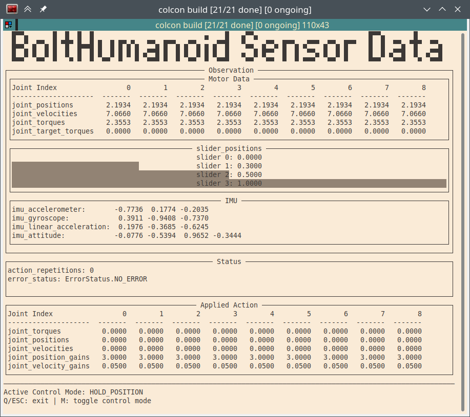

*************************
Applications and Examples
*************************

Test with the Robot
===================

To test if everything is working properly (i.e. connection to robot is working
and all sensor data is transferred correctly, there is the application
``bolthumanoid_show_data``. It starts the robot and then simply holds all joints at
the initial position while printing all observation and status data. It can be
run with

.. code:: bash

   ros2 run robot_interfaces_bolt bolthumanoid_show_data path/to/config.yml

It should look like this:

Examples
========

There are a few demos/examples showing the basic usage:

-  **demo_bolthumanoid_hold** [C++]: Initialises the robot and then simply holds the
  joints in place using position commands. It is implemented in
  ``demos/demo_bolthumanoid_hold.cpp`` and can be run with

   .. code:: bash

      ros2 run robot_interfaces_bolt demo_bolthumanoid_hold path/to/config.yml

-  **demo_bolthumanoid_sine** [Python]: Initialises the robot and then moves all
  joints back and forth using a sine profile. It is implemented in
  ``demos/demo_bolthumanoid_sine.py`` and can be run with

   .. code:: bash

      ros2 run robot_interfaces_bolt demo_bolthumanoid_sine path/to/config.yml

-  **demo_bolthumanoid_simulation** [Python]: Shows how to use a simulation backend,
  including directly accessing the simulation to obtain additional data. It is
  implemented in ``demos/demo_bolthumanoid_simulation.py`` and can be run with

   .. code:: bash

      ros2 run robot_interfaces_bolt demo_bolthumanoid_simulation

These demos should give an idea on how to use robot_interfaces with the BoltHumanoid
driver.
